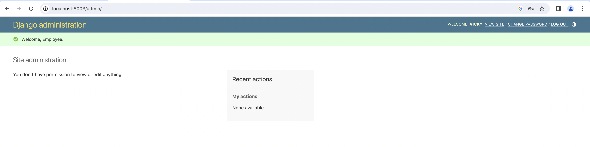
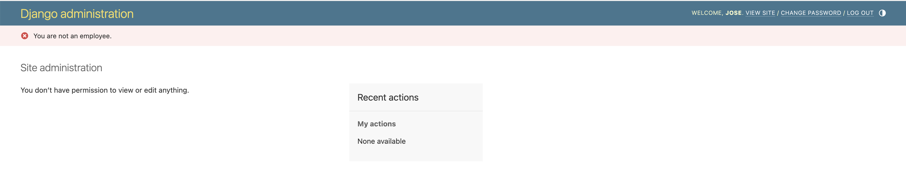

# Local Setup

To run the entire service locally, follow these steps:

1. Clone the Repository
    ```bash
    git clone https://github.com/geek-ragazza/django-nginx-docker-example.git
    cd django-nginx-docker-example
    ```

2. Build and Run the Docker Containers
    ```bash
    docker-compose up --build
    ```
    This command will build the Docker images and start the services. The Django application will be available at http://localhost:8003.

3. Access the Application
    - Login Page: Navigate to http://localhost:8003 to access the login page.
    - Register: If you don't have an account, click on the "Sign Up" button in the navbar to create a new account.
    - Login: Use your registered username and password to log in.


4. Admin Access
    - Admin URL: http://localhost:8003/admin/
    - Username: admin
    - Password: Initium1022

    In the admin panel, you can manage users and employees. Users who are employees will display their employee status.

# Application Features

- User Registration/Login/Logout: 
    - Users can register with a username, password, and confirm password. Optionally, they can provide their employee name.
- Home Page: 
    - After logging in, the home page displays the user's name username.
- Navbar: 
    - The navbar provides options to log out and, on the login page, a "Sign Up" button to create a new account.
- Admin Panel: 
    - Accessible at /admin, it allows the admin to manage users and employees

# Custom Admin Panel Message

When a user logs in, they will see a custom message in the admin panel based on their roles:

- **Welcome, Employee**: If the user has the "is_employee" permission. (Example: Username: vicky, Password: Initium1022)

- **You are not an employee**: If the user does not have the "is_employee" permission. (Example: Username: jose, Password: Initium1022, or sign up for a new account)

# Example Screenshots
1. Login
    
2. Register
    
3. Admin Employee
    
5. Admin is not employee
    

